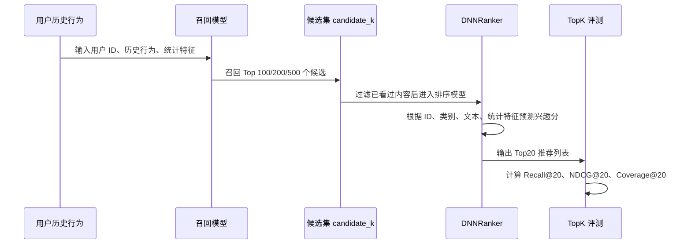
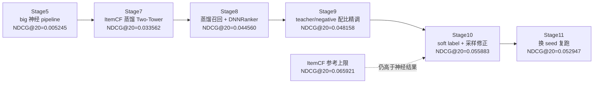
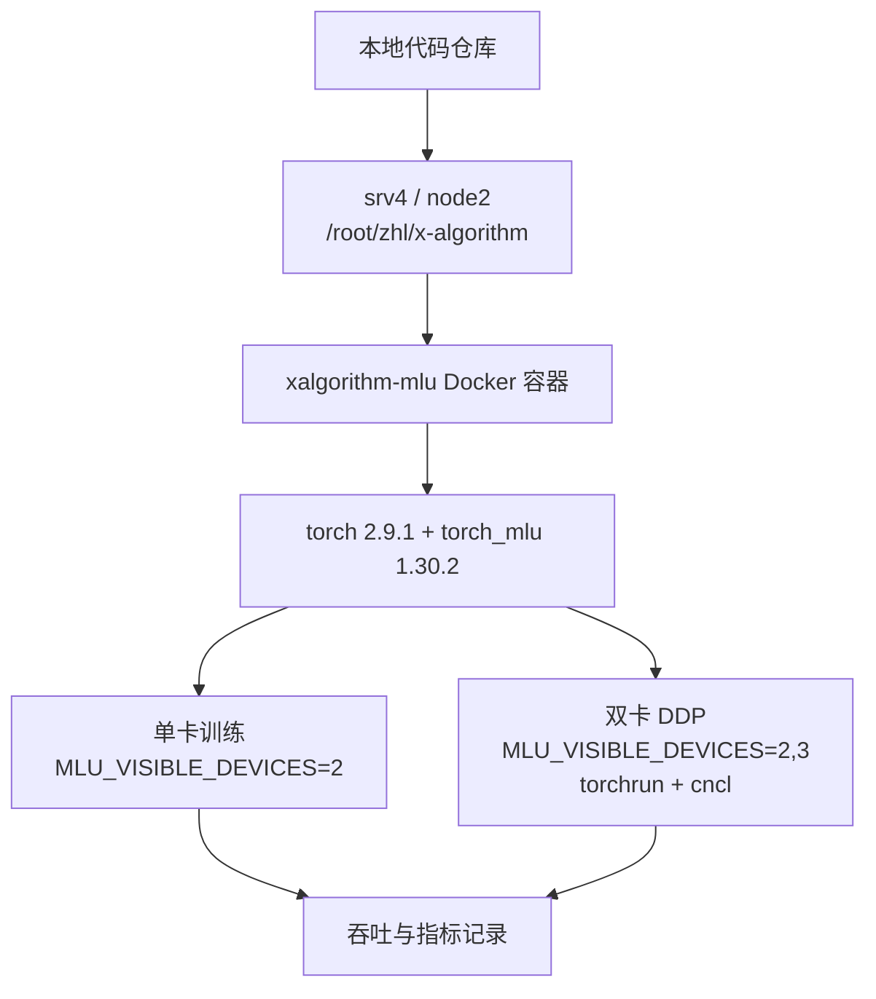

# 推荐系统学习项目架构图

## 1. 文档目的

这份文档回答一个问题：当前项目到底是怎么组织实验的？

本项目不是从零复刻 X/Twitter 的线上系统，而是参考它的多阶段推荐思想，在公开数据集上复现一个离线训练与评测闭环。整体链路是：

```text
数据集 -> 样本构造 -> 召回 -> 排序 -> 重排/融合 -> 离线评测 -> 报告与简历材料
```

## 2. 总体架构

```mermaid
flowchart TD
    subgraph Data[数据层]
        ML[MovieLens 1M<br/>评分行为]
        MIND[MIND-small<br/>新闻曝光与点击]
        KR[KuaiRec<br/>短视频观看行为]
    end

    subgraph Prep[数据处理层]
        Clean[清洗与字段解析]
        Label[正负反馈标签<br/>rating / click / watch_ratio]
        Split[训练/验证/测试切分]
        Feature[ID / 类别 / 文本哈希 / 统计特征]
    end

    subgraph Recall[召回层]
        Pop[Popularity]
        ItemCF[ItemCF]
        MF[MF]
        Tower[Two-Tower / ContentTwoTower]
        Distill[ItemCF-Distill-TwoTower]
    end

    subgraph Rank[排序层]
        Ranker[DNNRanker]
        HN[hard negative 样本]
        Soft[teacher soft label]
    end

    subgraph Pipeline[多阶段推荐]
        Candidate[candidate_k 候选集]
        Rerank[DNN 重排]
        Blend[双塔分数 + Ranker 分数融合]
    end

    subgraph Eval[评测与工程]
        Metrics[Recall@K / NDCG@K / AUC / LogLoss]
        MLU[torch_mlu / MLU 单卡与双卡 DDP]
        Reports[Markdown 报告 / CSV 结果 / 简历材料]
    end

    Data --> Clean --> Label --> Split --> Feature
    Feature --> Pop
    Feature --> ItemCF
    Feature --> MF
    Feature --> Tower
    ItemCF --> Distill
    Tower --> Candidate
    Distill --> Candidate
    Feature --> Ranker
    HN --> Ranker
    Soft --> Distill
    Candidate --> Rerank
    Ranker --> Rerank
    Candidate --> Blend
    Ranker --> Blend
    Rerank --> Metrics
    Blend --> Metrics
    MF --> Metrics
    Tower --> Metrics
    Distill --> Metrics
    Metrics --> Reports
    Tower --> MLU
    Ranker --> MLU
    Distill --> MLU
```

## 3. 三批数据集分工

| 数据集 | 业务场景 | 本项目中承担的学习目标 |
|---|---|---|
| MovieLens 1M | 用户给电影评分 | 用最简单的数据跑通数据处理、正反馈、TopK 评测、召回和排序 |
| MIND-small | 用户浏览新闻曝光列表并点击 | 学习内容推荐，加入标题、摘要、类别、曝光候选和点击标签 |
| KuaiRec | 用户观看短视频 | 学习短视频信息流推荐，加入观看时长、完播率、类别、caption、big 候选池和 MLU 工程 |

## 4. 离线推荐 Pipeline



在这个项目里，召回层负责“从大量内容里找可能相关的候选”，排序层负责“在候选里把真正更可能命中的内容排到前面”。这也是为什么很多实验同时记录 `candidate_k`、`Recall@K` 和 `NDCG@K`。

## 5. 当前模型结构

| 模型 | 结构 | 作用 |
|---|---|---|
| Popularity | 按全局热度排序 | 最低 baseline，判断数据是否有长尾和热门偏置 |
| Category | 按用户偏好类别召回 | 内容类别 baseline |
| ItemCF | 物品共现相似度 `co_count(i,j) / sqrt(count(i) * count(j))` | 传统协同过滤，KuaiRec big 上仍很强 |
| MF | 用户 embedding + 物品 embedding 点积 + bias | 学习基础协同信号 |
| Two-Tower | 用户塔 MLP + 内容塔 MLP + 点积 | 工业召回常用结构 |
| ContentTwoTower | Two-Tower + 标题/摘要哈希文本 embedding | MIND 新闻内容推荐 |
| DNNRanker | ID embedding、类别、文本、统计特征拼接后进入 MLP | 候选内精排 |
| ItemCF-Distill-TwoTower | 用 ItemCF TopK 作为 teacher 训练 Two-Tower | 把传统协同过滤信号迁移到神经召回 |
| TwoTower+DNN-Rerank | 先召回，再 Ranker 重排 | 模拟真实推荐系统多阶段 pipeline |

当前 Two-Tower 不是 Transformer，也不是 Grok/LLM。它是轻量推荐表征模型：用户塔和内容塔分别输出向量，最后用点积算相似度。

## 6. KuaiRec 最终优化链路



这个链路说明：提升不是靠盲目加深 MLP，而是靠更贴合 TopK 任务的训练信号，包括 ItemCF teacher、hard negative、随机负样本比例和 soft label。

## 7. MLU 训练架构



当前已经验证：

| 配置 | 结果 |
|---|---:|
| 单卡 MLU benchmark | `723,335 samples/s` |
| 双卡 DDP benchmark | `908,159 samples/s` |
| 双卡提升 | 约 `25.6%` |

## 8. 最终产物关系

| 产物 | 路径 | 用途 |
|---|---|---|
| 总实验报告 | `docs/project_summary_report.md` | 汇总三批数据集结果 |
| 总路线 | `docs/project_roadmap.md` | 记录项目阶段、当前状态和后续方向 |
| 阅读指南 | `docs/experiment_reading_guide.md` | 告诉自己和面试官从哪里看实验 |
| 简历写法 | `docs/resume_project_writeup.md` | 转成简历 bullet |
| 面试问答 | `docs/interview_qa.md` | 准备项目追问 |
| MovieLens 实验 | `experiments/movielens_recall/` | 入门闭环 |
| MIND 实验 | `experiments/mind_news/` | 内容推荐 |
| KuaiRec 实验 | `experiments/kuairec_short_video/` | 短视频和 MLU 工程 |
